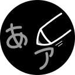
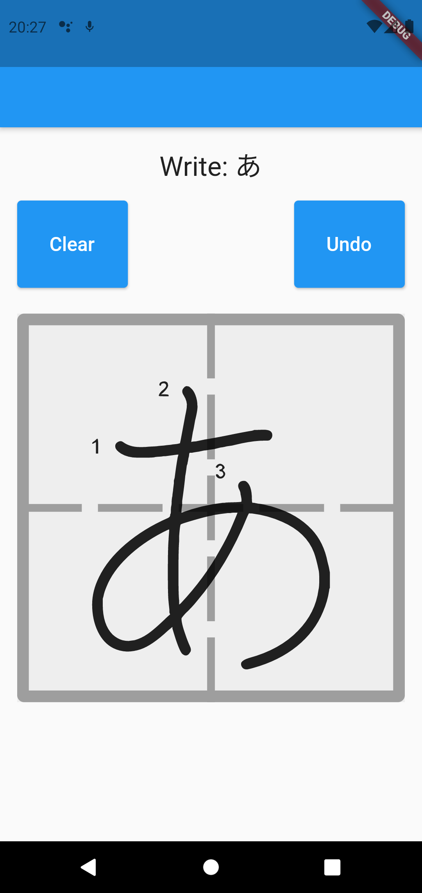
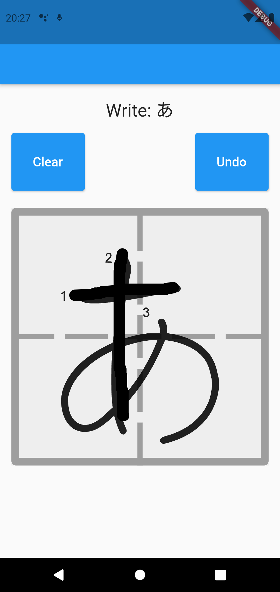
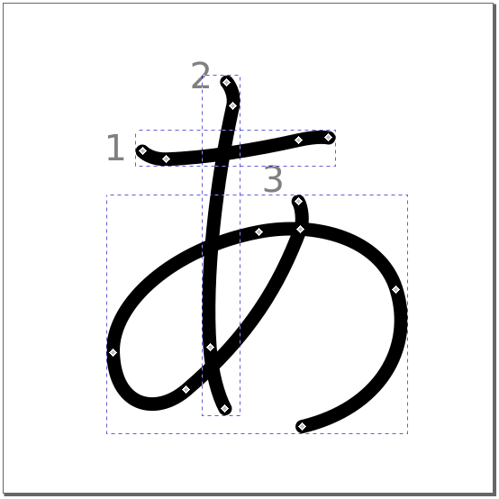
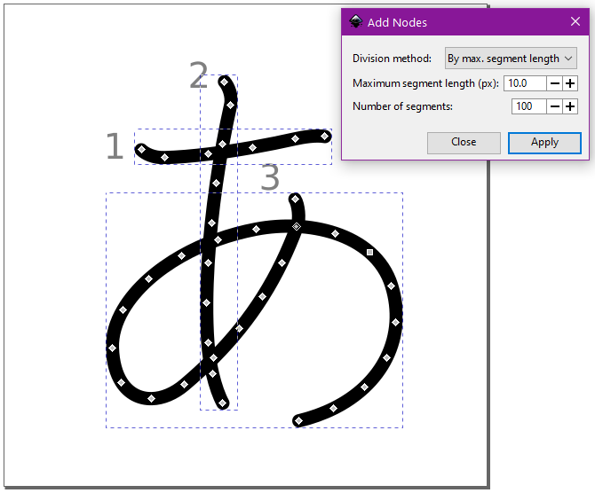

<h1 align="center">
    
    Simple Kana Recognizer
</h1>

Simple Kana Recognizer is an app built in Flutter that allows you to recognize the kana (hiragana and katakana) drawn in the app.

 <a href="#about-the-project">About the project</a> •
 <a href="#technologies">Technologies</a> • 
 <a href="#license">License</a>

# About the project

The project consists of recognizing the user-drawn kanas on an android (iOS was not used due to the lack of equipment to test).

To build the application, Flutter was used with the MVC architecture only to separate it into layers.

* The view layer contains the page and state management as well as the part that recognizes the points drawn on the screen.

* The controller layer contains the logic of each page and stores the data as the points of each drawn trace. It also recover data from the model layer as well as redirects the data to be processed outside the controller.

* The model layer contains the data store. As there is little data, no database was used, as there is no need to add complexity. It also contains services that simulate external packages in which one is used to reduce points using the Ramer–Douglas–Peucker algorithm and another algorithm to recognize the points of strokes in kana.

The kana points for comparison were taken from the SVG images generated by [Ulrich Apel - KanjiVG](https://kanjivg.tagaini.net/). To generate the points, I created an algorithm in python where it extracts, separates only the kanas (hiragana to katakana) and takes the points from the SVG images. However, as the points were insufficient for the algorithm, I needed to increase the amount of points in each image using Inkscape.

The Ramer–Douglas–Peucker algorithm was based on the project of [Snegovikufa](https://gist.github.com/Snegovikufa/6490663).

To draw and recover the stroke points, it was based on the project of [jayndu](https://jaycoding.tech/tutorials/guides/efficient-sketching-app-using-flutter-icstum).

# Technologies

# License

The license is in accordance with MIT, however, while not mandatory, I would like you to cite that the code was based on this project.
